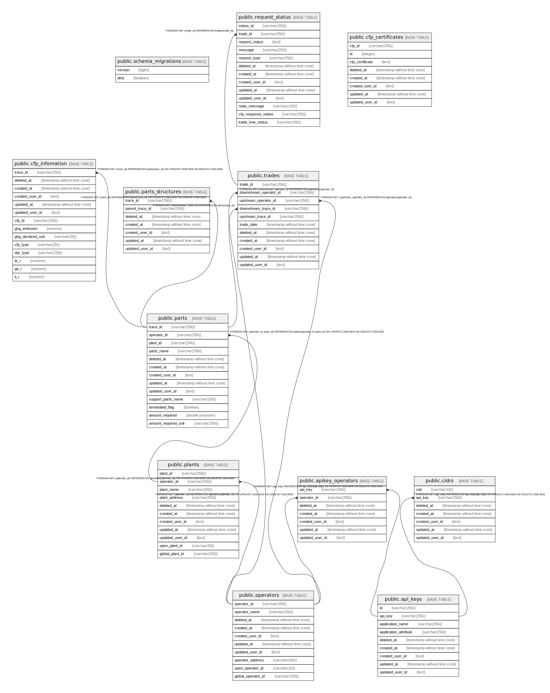

# dhlocal

## Tables

| Name | Columns | Comment | Type |
| ---- | ------- | ------- | ---- |
| [public.schema_migrations](public.schema_migrations.md) | 2 |  | BASE TABLE |
| [public.operators](public.operators.md) | 10 | 事業者テーブル | BASE TABLE |
| [public.plants](public.plants.md) | 11 | 事業所テーブル | BASE TABLE |
| [public.parts](public.parts.md) | 13 | APIKEYと事業者識別子の中間テーブル | BASE TABLE |
| [public.cfp_infomation](public.cfp_infomation.md) | 14 | 部品構成表（部品構成が違えば、同じ部品でも違うIDが振られる） | BASE TABLE |
| [public.trades](public.trades.md) | 11 |  | BASE TABLE |
| [public.cfp_certificates](public.cfp_certificates.md) | 8 |  | BASE TABLE |
| [public.parts_structures](public.parts_structures.md) | 7 | 部品構成表（部品構成が違えば、同じ部品でも違うIDが振られる） | BASE TABLE |
| [public.request_status](public.request_status.md) | 13 |  | BASE TABLE |
| [public.api_keys](public.api_keys.md) | 9 | APIKEYテーブル | BASE TABLE |
| [public.apikey_operators](public.apikey_operators.md) | 7 |  | BASE TABLE |
| [public.cidrs](public.cidrs.md) | 7 | CIDRテーブル | BASE TABLE |

## Relations

---

> Generated by [tbls](https://github.com/k1LoW/tbls)
