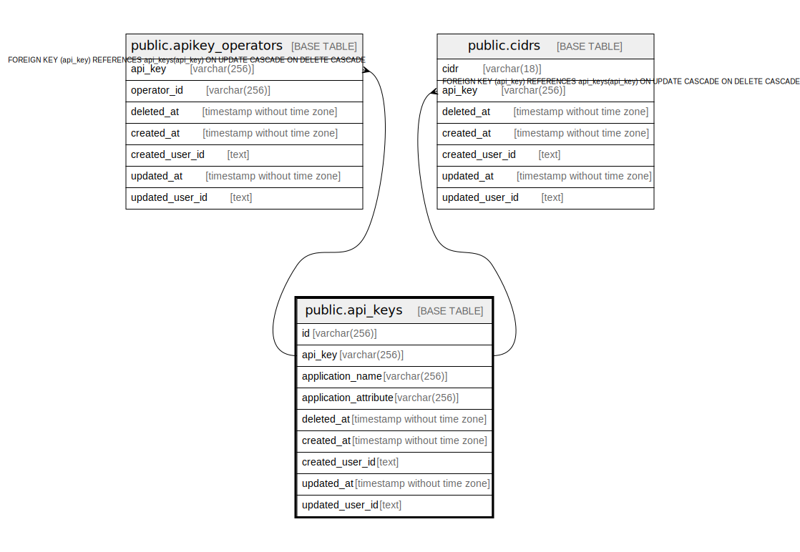

# public.api_keys

## Description

APIKEYテーブル

## Columns

| Name | Type | Default | Nullable | Children | Parents | Comment |
| ---- | ---- | ------- | -------- | -------- | ------- | ------- |
| id | varchar(256) | gen_random_uuid() | false |  |  | APIKEYID |
| api_key | varchar(256) |  | false | [public.apikey_operators](public.apikey_operators.md) [public.cidrs](public.cidrs.md) |  | APIKEY |
| application_name | varchar(256) |  | false |  |  | アプリケーション名 |
| application_attribute | varchar(256) |  | false |  |  | アプリケーション属性(admin,cfp_user,traceability) |
| deleted_at | timestamp without time zone |  | true |  |  | 論理削除日時 |
| created_at | timestamp without time zone |  | false |  |  | 作成日時 |
| created_user_id | text |  | false |  |  | 作成ユーザ |
| updated_at | timestamp without time zone |  | false |  |  | 更新日時 |
| updated_user_id | text |  | false |  |  | 更新ユーザ |

## Constraints

| Name | Type | Definition |
| ---- | ---- | ---------- |
| api_keys_pkey | PRIMARY KEY | PRIMARY KEY (id) |
| api_key_unique | UNIQUE | UNIQUE (api_key) |

## Indexes

| Name | Definition |
| ---- | ---------- |
| api_keys_pkey | CREATE UNIQUE INDEX api_keys_pkey ON public.api_keys USING btree (id) |
| api_key_unique | CREATE UNIQUE INDEX api_key_unique ON public.api_keys USING btree (api_key) |

## Relations

---

> Generated by [tbls](https://github.com/k1LoW/tbls)
