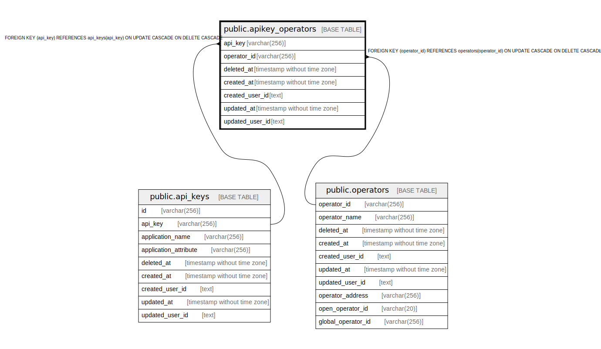

# public.apikey_operators

## Description

## Columns

| Name | Type | Default | Nullable | Children | Parents | Comment |
| ---- | ---- | ------- | -------- | -------- | ------- | ------- |
| api_key | varchar(256) |  | false |  | [public.api_keys](public.api_keys.md) | APIキー(外部Key) |
| operator_id | varchar(256) |  | false |  | [public.operators](public.operators.md) | 事業者識別子（外部Key） |
| deleted_at | timestamp without time zone |  | true |  |  | 論理削除日時 |
| created_at | timestamp without time zone |  | false |  |  | 作成日時 |
| created_user_id | text |  | false |  |  | 作成ユーザ |
| updated_at | timestamp without time zone |  | false |  |  | 更新日時 |
| updated_user_id | text |  | false |  |  | 更新ユーザ |

## Constraints

| Name | Type | Definition |
| ---- | ---- | ---------- |
| apikey_operators_operator_id_fkey | FOREIGN KEY | FOREIGN KEY (operator_id) REFERENCES operators(operator_id) ON UPDATE CASCADE ON DELETE CASCADE |
| apikey_operators_api_key_fkey | FOREIGN KEY | FOREIGN KEY (api_key) REFERENCES api_keys(api_key) ON UPDATE CASCADE ON DELETE CASCADE |
| apikey_operators_pkey | PRIMARY KEY | PRIMARY KEY (api_key, operator_id) |

## Indexes

| Name | Definition |
| ---- | ---------- |
| apikey_operators_pkey | CREATE UNIQUE INDEX apikey_operators_pkey ON public.apikey_operators USING btree (api_key, operator_id) |

## Relations

---

> Generated by [tbls](https://github.com/k1LoW/tbls)
