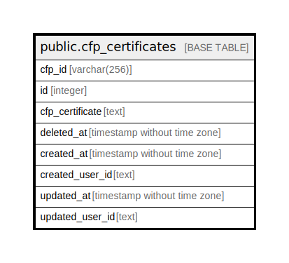

# public.cfp_certificates

## Description

## Columns

| Name | Type | Default | Nullable | Children | Parents | Comment |
| ---- | ---- | ------- | -------- | -------- | ------- | ------- |
| cfp_id | varchar(256) |  | false |  |  |  |
| id | integer |  | false |  |  |  |
| cfp_certificate | text |  | false |  |  |  |
| deleted_at | timestamp without time zone |  | true |  |  |  |
| created_at | timestamp without time zone |  | false |  |  |  |
| created_user_id | text |  | false |  |  |  |
| updated_at | timestamp without time zone |  | false |  |  |  |
| updated_user_id | text |  | false |  |  |  |

## Constraints

| Name | Type | Definition |
| ---- | ---- | ---------- |
| cfp_certificates_pkey | PRIMARY KEY | PRIMARY KEY (cfp_id, id) |

## Indexes

| Name | Definition |
| ---- | ---------- |
| cfp_certificates_pkey | CREATE UNIQUE INDEX cfp_certificates_pkey ON public.cfp_certificates USING btree (cfp_id, id) |

## Relations

---

> Generated by [tbls](https://github.com/k1LoW/tbls)
