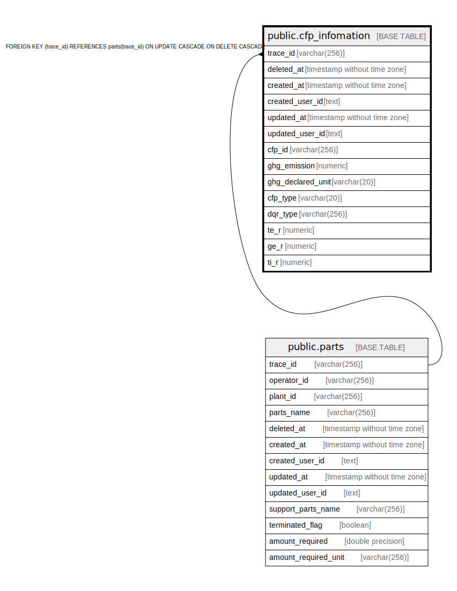

# public.cfp_infomation

## Description

部品構成表（部品構成が違えば、同じ部品でも違うIDが振られる）

## Columns

| Name | Type | Default | Nullable | Children | Parents | Comment |
| ---- | ---- | ------- | -------- | -------- | ------- | ------- |
| trace_id | varchar(256) |  | false |  | [public.parts](public.parts.md) | 展開元となる部品のトレース識別子 |
| deleted_at | timestamp without time zone |  | true |  |  | 論理削除日時 |
| created_at | timestamp without time zone |  | false |  |  | 作成日時 |
| created_user_id | text |  | false |  |  | 作成ユーザ |
| updated_at | timestamp without time zone |  | false |  |  | 更新日時 |
| updated_user_id | text |  | false |  |  | 更新ユーザ |
| cfp_id | varchar(256) |  | false |  |  |  |
| ghg_emission | numeric |  | true |  |  |  |
| ghg_declared_unit | varchar(20) |  | true |  |  |  |
| cfp_type | varchar(20) |  | false |  |  |  |
| dqr_type | varchar(256) |  | false |  |  |  |
| te_r | numeric |  | true |  |  |  |
| ge_r | numeric |  | true |  |  |  |
| ti_r | numeric |  | true |  |  |  |

## Constraints

| Name | Type | Definition |
| ---- | ---- | ---------- |
| cfp_infomation_trace_id_fkey | FOREIGN KEY | FOREIGN KEY (trace_id) REFERENCES parts(trace_id) ON UPDATE CASCADE ON DELETE CASCADE |
| cfp_infomation_pkey | PRIMARY KEY | PRIMARY KEY (trace_id, cfp_type) |

## Indexes

| Name | Definition |
| ---- | ---------- |
| cfp_infomation_pkey | CREATE UNIQUE INDEX cfp_infomation_pkey ON public.cfp_infomation USING btree (trace_id, cfp_type) |

## Relations

---

> Generated by [tbls](https://github.com/k1LoW/tbls)
