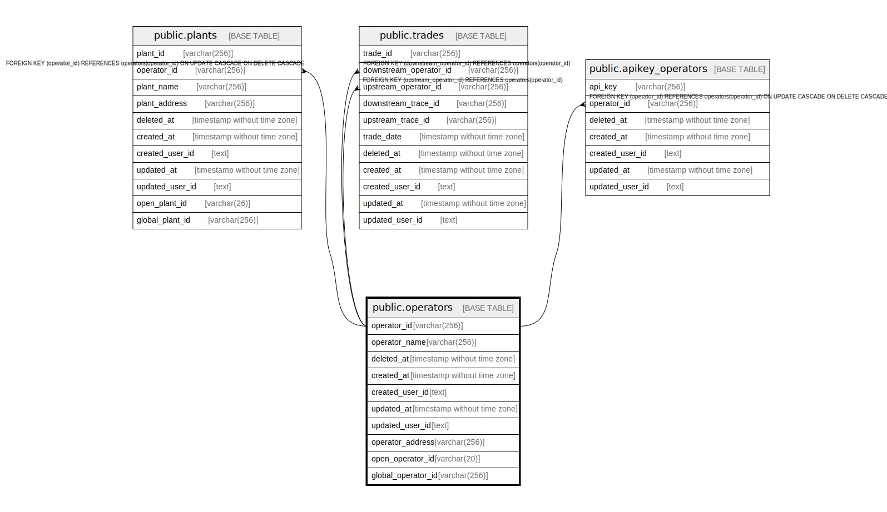

# public.operators

## Description

事業者テーブル

## Columns

| Name | Type | Default | Nullable | Children | Parents | Comment |
| ---- | ---- | ------- | -------- | -------- | ------- | ------- |
| operator_id | varchar(256) |  | false | [public.plants](public.plants.md) [public.trades](public.trades.md) [public.apikey_operators](public.apikey_operators.md) |  | 事業者識別子（LEIコード等一意になる文字列を想定） |
| operator_name | varchar(256) |  | false |  |  | 企業名 |
| deleted_at | timestamp without time zone |  | true |  |  | 論理削除日時 |
| created_at | timestamp without time zone |  | false |  |  | 作成日時 |
| created_user_id | text |  | false |  |  | 作成ユーザ |
| updated_at | timestamp without time zone |  | false |  |  | 更新日時 |
| updated_user_id | text |  | false |  |  | 更新ユーザ |
| operator_address | varchar(256) |  | false |  |  | 事業者所在地 |
| open_operator_id | varchar(20) |  | false |  |  | 公開事業者識別子 |
| global_operator_id | varchar(256) |  | true |  |  | 事業者識別子（グローバル） |

## Constraints

| Name | Type | Definition |
| ---- | ---- | ---------- |
| operators_pkey | PRIMARY KEY | PRIMARY KEY (operator_id) |
| unique_open_operator_id | UNIQUE | UNIQUE (open_operator_id) |
| unique_global_operator_id | UNIQUE | UNIQUE (global_operator_id) |

## Indexes

| Name | Definition |
| ---- | ---------- |
| operators_pkey | CREATE UNIQUE INDEX operators_pkey ON public.operators USING btree (operator_id) |
| unique_open_operator_id | CREATE UNIQUE INDEX unique_open_operator_id ON public.operators USING btree (open_operator_id) |
| unique_global_operator_id | CREATE UNIQUE INDEX unique_global_operator_id ON public.operators USING btree (global_operator_id) |

## Relations

---

> Generated by [tbls](https://github.com/k1LoW/tbls)
