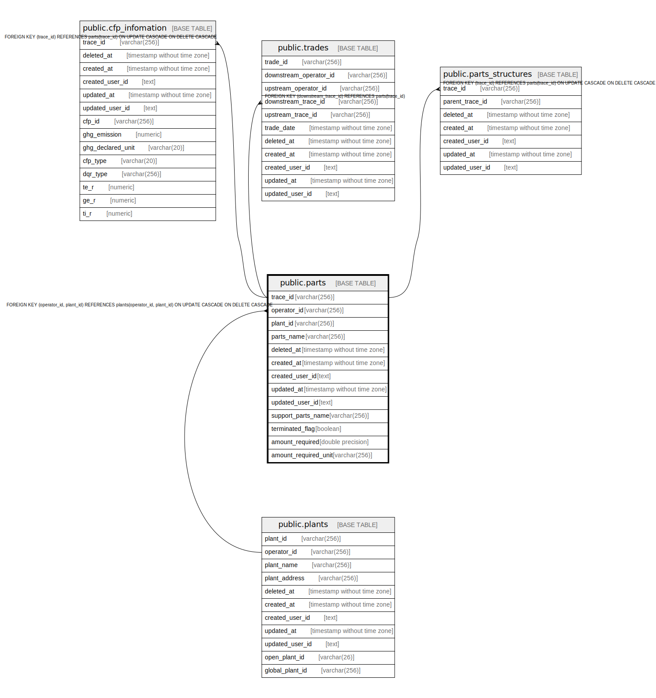

# public.parts

## Description

APIKEYと事業者識別子の中間テーブル

## Columns

| Name | Type | Default | Nullable | Children | Parents | Comment |
| ---- | ---- | ------- | -------- | -------- | ------- | ------- |
| trace_id | varchar(256) |  | false | [public.cfp_infomation](public.cfp_infomation.md) [public.trades](public.trades.md) [public.parts_structures](public.parts_structures.md) |  | トレース管理識別子（一意の部品と識別するID。暫定的にUUIDを利用） |
| operator_id | varchar(256) |  | false |  | [public.plants](public.plants.md) | 事業者識別子（外部Key） |
| plant_id | varchar(256) |  | false |  | [public.plants](public.plants.md) | 事業所識別子（外部Key） |
| parts_name | varchar(256) |  | true |  |  | 部品名 |
| deleted_at | timestamp without time zone |  | true |  |  | 論理削除日時 |
| created_at | timestamp without time zone |  | false |  |  | 作成日時 |
| created_user_id | text |  | false |  |  | 作成ユーザ |
| updated_at | timestamp without time zone |  | false |  |  | 更新日時 |
| updated_user_id | text |  | false |  |  | 更新ユーザ |
| support_parts_name | varchar(256) |  | true |  |  | 補助項目 |
| terminated_flag | boolean | false | false |  |  | 終端フラグ |
| amount_required | double precision |  | true |  |  | 活動量 |
| amount_required_unit | varchar(256) |  | true |  |  | 活動量単位 |

## Constraints

| Name | Type | Definition |
| ---- | ---- | ---------- |
| parts_operator_id_plant_id_fkey | FOREIGN KEY | FOREIGN KEY (operator_id, plant_id) REFERENCES plants(operator_id, plant_id) ON UPDATE CASCADE ON DELETE CASCADE |
| parts_pkey | PRIMARY KEY | PRIMARY KEY (trace_id) |

## Indexes

| Name | Definition |
| ---- | ---------- |
| parts_pkey | CREATE UNIQUE INDEX parts_pkey ON public.parts USING btree (trace_id) |

## Relations

---

> Generated by [tbls](https://github.com/k1LoW/tbls)
