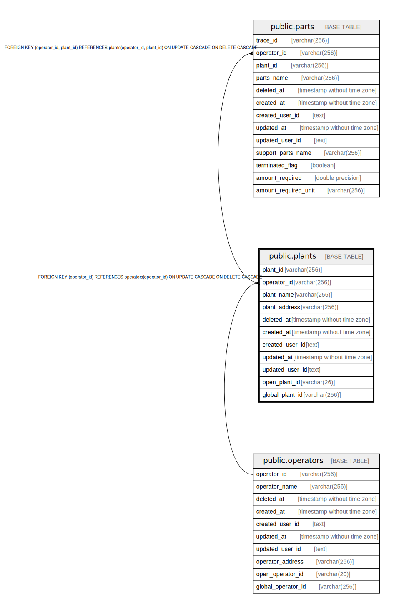

# public.plants

## Description

事業所テーブル

## Columns

| Name | Type | Default | Nullable | Children | Parents | Comment |
| ---- | ---- | ------- | -------- | -------- | ------- | ------- |
| plant_id | varchar(256) |  | false | [public.parts](public.parts.md) |  | 事業所識別子 |
| operator_id | varchar(256) |  | false | [public.parts](public.parts.md) | [public.operators](public.operators.md) | 事業者識別子（外部Key） |
| plant_name | varchar(256) |  | false |  |  | 事業所名 |
| plant_address | varchar(256) |  | false |  |  | 事業所所在値（住所） |
| deleted_at | timestamp without time zone |  | true |  |  | 論理削除日時 |
| created_at | timestamp without time zone |  | false |  |  | 作成日時 |
| created_user_id | text |  | false |  |  | 作成ユーザ |
| updated_at | timestamp without time zone |  | false |  |  | 更新日時 |
| updated_user_id | text |  | false |  |  | 更新ユーザ |
| open_plant_id | varchar(26) |  | false |  |  | 公開事業所識別子 |
| global_plant_id | varchar(256) |  | true |  |  | 事業所識別子（グローバル） |

## Constraints

| Name | Type | Definition |
| ---- | ---- | ---------- |
| plants_operator_id_fkey | FOREIGN KEY | FOREIGN KEY (operator_id) REFERENCES operators(operator_id) ON UPDATE CASCADE ON DELETE CASCADE |
| plants_pkey | PRIMARY KEY | PRIMARY KEY (plant_id, operator_id) |
| unique_open_plant_id_operator_id | UNIQUE | UNIQUE (operator_id, open_plant_id) |
| unique_global_plant_id_operator_id | UNIQUE | UNIQUE (operator_id, global_plant_id) |

## Indexes

| Name | Definition |
| ---- | ---------- |
| plants_pkey | CREATE UNIQUE INDEX plants_pkey ON public.plants USING btree (plant_id, operator_id) |
| unique_open_plant_id_operator_id | CREATE UNIQUE INDEX unique_open_plant_id_operator_id ON public.plants USING btree (operator_id, open_plant_id) |
| unique_global_plant_id_operator_id | CREATE UNIQUE INDEX unique_global_plant_id_operator_id ON public.plants USING btree (operator_id, global_plant_id) |

## Relations

---

> Generated by [tbls](https://github.com/k1LoW/tbls)
