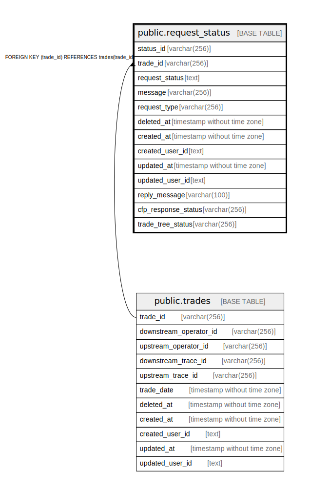

# public.request_status

## Description

## Columns

| Name | Type | Default | Nullable | Children | Parents | Comment |
| ---- | ---- | ------- | -------- | -------- | ------- | ------- |
| status_id | varchar(256) |  | false |  |  |  |
| trade_id | varchar(256) |  | false |  | [public.trades](public.trades.md) |  |
| request_status | text |  | true |  |  |  |
| message | varchar(256) |  | true |  |  |  |
| request_type | varchar(256) |  | false |  |  |  |
| deleted_at | timestamp without time zone |  | true |  |  |  |
| created_at | timestamp without time zone |  | false |  |  |  |
| created_user_id | text |  | false |  |  |  |
| updated_at | timestamp without time zone |  | false |  |  |  |
| updated_user_id | text |  | false |  |  |  |
| reply_message | varchar(100) |  | true |  |  | 差戻メッセージ |
| cfp_response_status | varchar(256) |  | true |  |  | CFPの回答状況 |
| trade_tree_status | varchar(256) |  | true |  |  | 取引関係情報終端状況 |

## Constraints

| Name | Type | Definition |
| ---- | ---- | ---------- |
| request_status_trade_id_fkey | FOREIGN KEY | FOREIGN KEY (trade_id) REFERENCES trades(trade_id) |
| request_status_pkey | PRIMARY KEY | PRIMARY KEY (status_id) |

## Indexes

| Name | Definition |
| ---- | ---------- |
| request_status_pkey | CREATE UNIQUE INDEX request_status_pkey ON public.request_status USING btree (status_id) |

## Relations

---

> Generated by [tbls](https://github.com/k1LoW/tbls)
