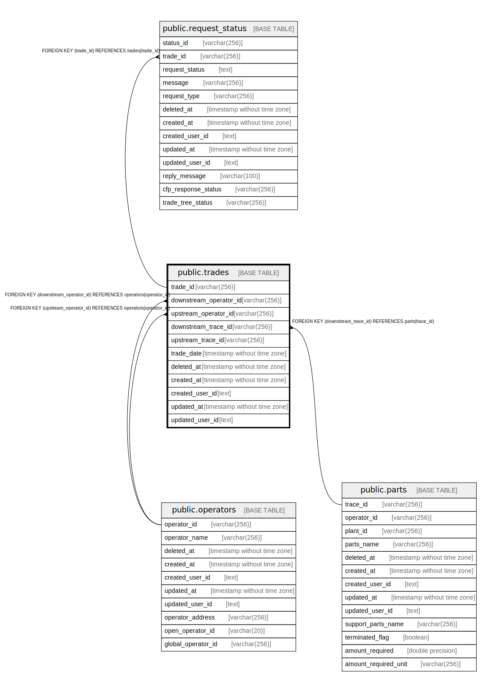

# public.trades

## Description

## Columns

| Name | Type | Default | Nullable | Children | Parents | Comment |
| ---- | ---- | ------- | -------- | -------- | ------- | ------- |
| trade_id | varchar(256) |  | false | [public.request_status](public.request_status.md) |  |  |
| downstream_operator_id | varchar(256) |  | false |  | [public.operators](public.operators.md) |  |
| upstream_operator_id | varchar(256) |  | false |  | [public.operators](public.operators.md) |  |
| downstream_trace_id | varchar(256) |  | false |  | [public.parts](public.parts.md) |  |
| upstream_trace_id | varchar(256) |  | true |  |  |  |
| trade_date | timestamp without time zone |  | true |  |  |  |
| deleted_at | timestamp without time zone |  | true |  |  |  |
| created_at | timestamp without time zone |  | false |  |  |  |
| created_user_id | text |  | false |  |  |  |
| updated_at | timestamp without time zone |  | false |  |  |  |
| updated_user_id | text |  | false |  |  |  |

## Constraints

| Name | Type | Definition |
| ---- | ---- | ---------- |
| trades_downstream_operator_id_fkey | FOREIGN KEY | FOREIGN KEY (downstream_operator_id) REFERENCES operators(operator_id) |
| trades_upstream_operator_id_fkey | FOREIGN KEY | FOREIGN KEY (upstream_operator_id) REFERENCES operators(operator_id) |
| trades_downstream_trace_id_fkey | FOREIGN KEY | FOREIGN KEY (downstream_trace_id) REFERENCES parts(trace_id) |
| trades_pkey | PRIMARY KEY | PRIMARY KEY (trade_id) |

## Indexes

| Name | Definition |
| ---- | ---------- |
| trades_pkey | CREATE UNIQUE INDEX trades_pkey ON public.trades USING btree (trade_id) |

## Relations

---

> Generated by [tbls](https://github.com/k1LoW/tbls)
